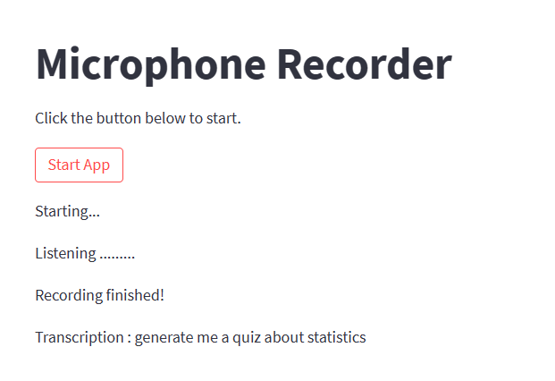
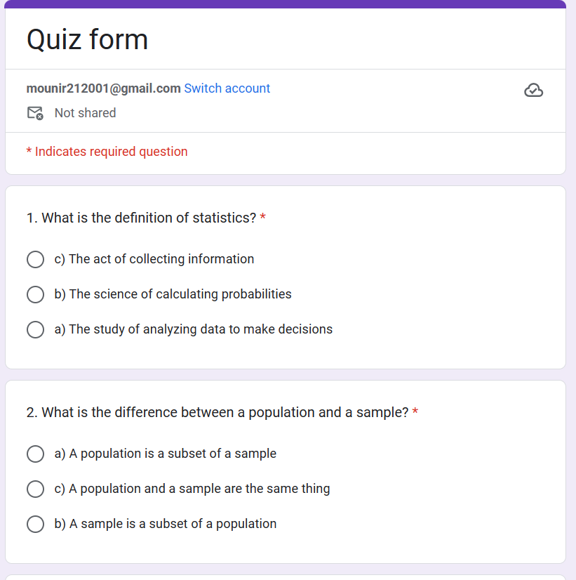

# 🎙️ Quiz Generator – Turn Your Voice into a Quiz!

Transform your voice into an interactive quiz using GPT-3.5 + Streamlit!

# 🚀 Description
Quiz Generator is a smart web app that listens to your voice, understands what you say, and instantly creates a personalized quiz. It combines speech recognition, natural language processing, and an interactive UI.

  

# ✨ Features

🎤 Record your voice to set the topic and number of questions.

🧠 Automatic transcription via Google Speech-to-Text.

🤖 Question and answer generation with OpenAI GPT-3.5.

🧪 Interactive interface – take the quiz right inside the app.

📊 Real-time scoring with instant feedback.

# 🧰 Technologies

- Python

- Streamlit – For a fast and clean UI

- Sounddevice & Soundfile – Audio recording

- SpeechRecognition – Voice-to-text transcription

- OpenAI GPT-3.5 – Smart content generation

  

